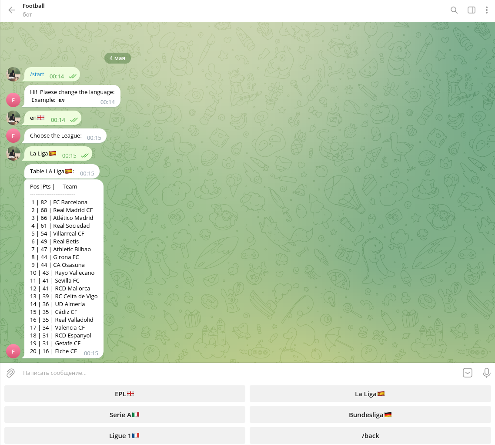
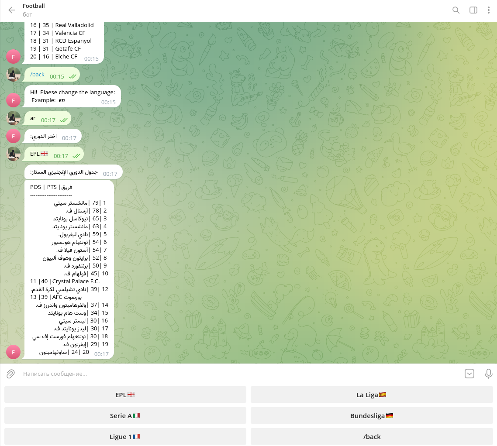
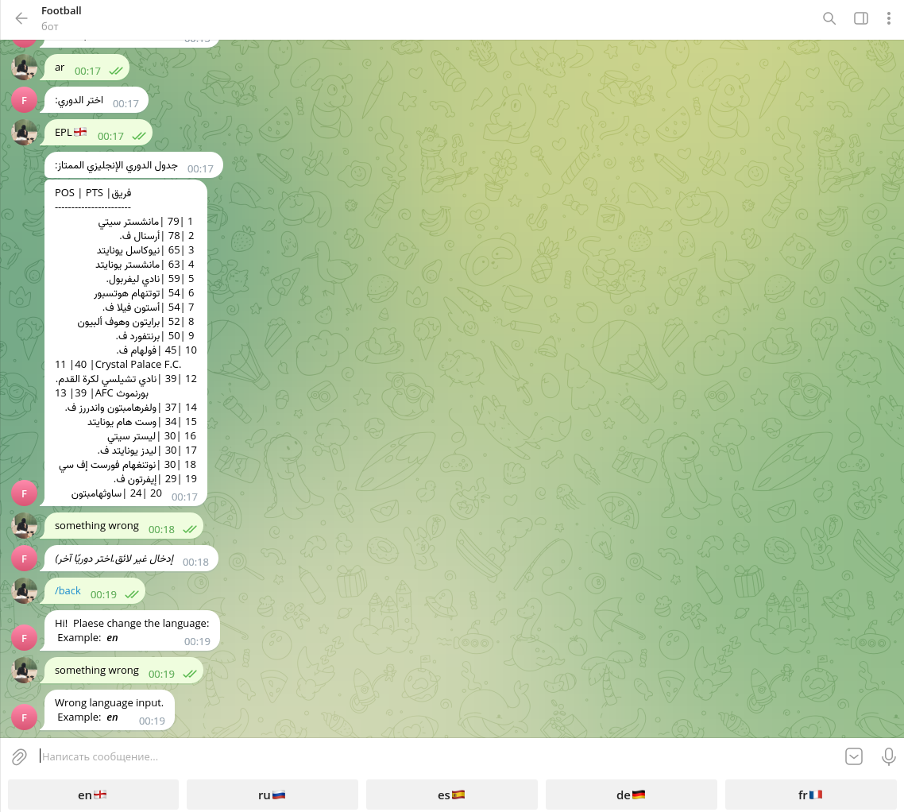

# TGbot

### Hello football fans👋.

This telegram bot is written in python, it is
available in more than 100 languages of the world.
It parses from the wiki site and shows you the
standings of the top 5 european football leagues.
All you need to do is clone the branch, paste your
token into the config.py folder and run via run.sh

#### Link for clonning:

```bash
git clone https://github.com/RahimGulyamov/TGbot
```

#### Run:

```
./run.sh
```

#### Commands:

+ /start - start or restart bot
+ /back - go back to choose language

#### Links, which parced:

```bash
https://en.wikipedia.org/wiki/2022%E2%80%9323_Premier_League
https://en.wikipedia.org/wiki/2022%E2%80%9323_La_Liga
https://en.wikipedia.org/wiki/2022%E2%80%9323_Serie_A
https://en.wikipedia.org/wiki/2022%E2%80%9323_Ligue_1
https://en.wikipedia.org/wiki/2022%E2%80%9323_Bundesliga
```

<<<<<<< HEAD

## Some screenshots from bot:

### The beginning of the bot.


### Running time.



### Another language. WebHook, Localisation



### Wrong input



## About Docker:

This Dockerfile creates a container image based on the latest stable release of the Ubuntu operating system. It then
copies all files from the current directory into the /opt/ directory inside the container and sets the working directory
to /opt/. Next, it updates repositories and installs python3 and python3-pip inside the container. It then installs the
required dependencies from the requirements.txt file using pip. Finally, the container will run main.py using python3 as
the default command when the container is launched.

#### Run the following command to use docker:
(docker should be installed)
```bash
docker build -t image-name .
```

where `image-name` is the name of the future image (it can be anything), and the dot means the current directory.
Once Docker has built the image, you can start the container with the command:

```bash
docker run image-name
```

Now the container will run and run the main.py file inside of itself.